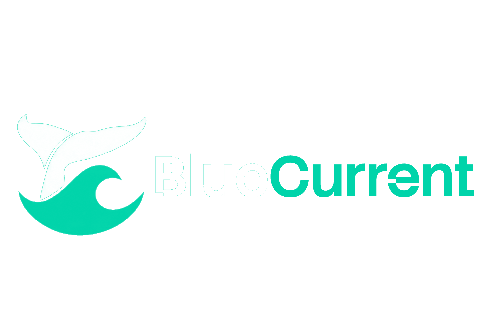
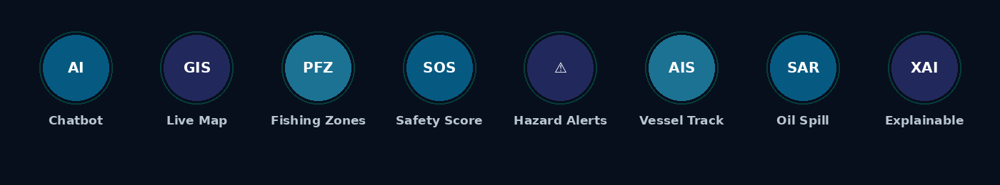
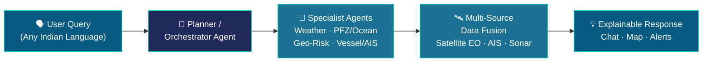

<div align="center">



<br/>

[](https://blue-current-godson.vercel.app/)
[](https://bluecurrent-ui47.onrender.com)
[](LICENSE)

[](https://react.dev)
[](https://www.typescriptlang.org/)
[](https://vitejs.dev)
[](https://nodejs.org)
[](https://socket.io)
[](https://vercel.com)
[](https://render.com)

**[🌊 Live App](https://blue-current-godson.vercel.app/)&nbsp;&nbsp;·&nbsp;&nbsp;[⚙️ API Health](https://bluecurrent-ui47.onrender.com)**

</div>

<br/>

## 🌐 What is BlueCurrent?

BlueCurrent is a conversational, multi-agent AI platform that fuses **satellite Earth Observation data**, **AIS vessel tracks**, **bathymetric sonar**, and **weather advisories** — letting fishermen, coastal authorities, and researchers simply **ask, in plain language**:

> 💬 *"Where's today's nearest fishing zone?"*
> 💬 *"Is it safe to sail tomorrow?"*
> 💬 *"Are there any cyclone alerts near me?"*

...and get back an **explainable, map-backed, evidence-cited answer** — not just raw data.

Built for **Smart India Hackathon 2026** · Problem Statement **26176 — ORCA** (Dept. of Space / ISRO) · **Team ResQ**

<br/>

## ✨ Features at a Glance

<div align="center">

</div>

<br/>

| | Category | Capabilities |
|---|---|---|
| 🗣️ | **Conversational AI** | Marine AI chatbot · Multi-agent status/design view · Explainable AI evidence display |
| 🗺️ | **Situational Awareness** | Unified interactive marine map · Real-time hazard alert panel · Automatic geotagging |
| 🐟 | **Fisheries Intelligence** | Potential Fishing Zone (PFZ) recommendations · Fish reproductive-habitat mapping |
| 🛟 | **Safety & Risk** | Marine safety score · Smart geofencing · Safe-route optimisation |
| 🛢️ | **Environmental Monitoring** | Oil-spill detection workspace · Underwater debris / sonar-anomaly detection |
| 🚢 | **Fleet Intelligence** | AIS vessel-correlation workflow |
| 📡 | **Operations** | Automated operational reports · Low-connectivity / offline-ready mode |

<br/>

## 🧠 How It Works



A **Planner Agent** decomposes every query and coordinates specialist agents that independently retrieve and correlate live multi-source marine data — then a synthesis layer builds one explainable, cited response with maps and alerts.

<br/>

## 🛠️ Tech Stack

<table>
<tr>
<td valign="top" width="50%">

**Frontend**
- React + TypeScript
- Vite
- Socket.io-client
- Interactive GIS map

</td>
<td valign="top" width="50%">

**Backend**
- Node.js + Express
- Socket.io
- SQLite
- Multi-agent orchestration layer

</td>
</tr>
<tr>
<td valign="top">

**AI Layer**
- Planner + specialist agents
- LLM-based NLU/NLG
- Explainable evidence-chain reasoning

</td>
<td valign="top">

**Data Sources**
- Satellite EO (SST, chlorophyll)
- AIS vessel feeds
- Bathymetric sonar
- Weather/tide advisories · GIS layers

</td>
</tr>
</table>

**Deployment:** Frontend on [Vercel](https://vercel.com) · Backend on [Render](https://render.com)

<br/>

## 🚀 Getting Started

### Prerequisites
- Node.js 18+
- npm

### Clone & Install

```bash
git clone https://github.com/Godson-82/BlueCurrent.git
cd BlueCurrent

npm install              # frontend deps
cd server && npm install # backend deps
cd ..
```

### Environment Variables

<details>
<summary><strong>Root <code>.env</code></strong> (frontend — see <code>.env.example</code>)</summary>

```env
VITE_API_URL=http://localhost:4000
VITE_WS_URL=ws://localhost:4000
```
</details>

<details>
<summary><strong><code>server/.env</code></strong> (backend — see <code>server/.env.example</code>)</summary>

```env
ANTHROPIC_API_KEY=
ANTHROPIC_MODEL=claude-haiku-4-5-20251001
GROQ_API_KEY=
GROQ_MODEL=qwen/qwen3.8-27b
PORT=4000
```
</details>

> ⚠️ Never commit real API keys. Both `.env` files are gitignored.

### Run Locally

```bash
# Terminal 1 — backend
cd server && npm start

# Terminal 2 — frontend
npm run dev
```

Visit **http://localhost:5173**

<br/>

## ☁️ Deployment

| | |
|---|---|
| **Frontend** | Auto-deploys to Vercel on push to `main` |
| **Backend** | Auto-deploys to Render on push to `main` (root: `server/`) |

<br/>

## 👥 Team

<div align="center">

### Team ResQ
Smart India Hackathon 2026

</div>

<br/>

## 📄 License

MIT — see [LICENSE](LICENSE).

<div align="center">
<sub>Built with 🌊 for safer seas.</sub>
</div>