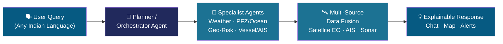

<div align="center">


### Agentic AI Marine Intelligence Platform

Built for **Smart India Hackathon 2026** · Problem Statement 26176 (ORCA) · Team ResQ

[](https://blue-current-godson.vercel.app/)
[](https://bluecurrent-ui47.onrender.com)
[](LICENSE)
[](https://react.dev)
[](https://nodejs.org)

**[🌊 Live App](https://blue-current-godson.vercel.app/)** · **[⚙️ API](https://bluecurrent-ui47.onrender.com)**

</div>

---

## What is BlueCurrent?

BlueCurrent is a conversational, multi-agent AI platform that fuses satellite Earth Observation data, AIS vessel tracks, bathymetric sonar, and weather advisories — letting fishermen, coastal authorities, and researchers simply **ask**, in plain language:

> *"Where's today's nearest fishing zone?"*
> *"Is it safe to sail tomorrow?"*
> *"Are there any cyclone alerts near me?"*

...and get back an explainable, map-backed, evidence-cited answer — not just raw data.

## How it works



## Features

| Category | Capabilities |
|---|---|
| **Conversational AI** | Marine AI chatbot · Multi-agent status/design view · Explainable AI evidence display |
| **Situational Awareness** | Unified interactive marine map · Real-time hazard alert panel · Automatic geotagging |
| **Fisheries Intelligence** | Potential Fishing Zone (PFZ) recommendations · Fish reproductive-habitat mapping |
| **Safety & Risk** | Marine safety score · Smart geofencing · Safe-route optimisation |
| **Environmental Monitoring** | Oil-spill detection workspace · Underwater debris / sonar-anomaly detection |
| **Fleet Intelligence** | AIS vessel-correlation workflow |
| **Operations** | Automated operational reports · Low-connectivity / offline-ready mode |

## Tech Stack

**Frontend** — React + TypeScript, Vite, Socket.io-client, interactive GIS map
**Backend** — Node.js, Express, Socket.io, SQLite
**AI Layer** — Multi-agent orchestration (planner + specialist agents), LLM-based NLU/NLG
**Data Sources** — Satellite EO (SST, chlorophyll), AIS feeds, bathymetric sonar, weather/tide advisories, GIS boundary layers

**Deployment** — Frontend on [Vercel](https://vercel.com), backend on [Render](https://render.com)

## Getting Started

### Prerequisites
- Node.js 18+
- npm

### Local Setup

```bash
# Clone the repo
git clone https://github.com/Godson-82/BlueCurrent.git
cd BlueCurrent

# Install frontend dependencies
npm install

# Install backend dependencies
cd server
npm install
cd ..
```

### Environment Variables

**Root `.env`** (frontend — see `.env.example`):
```
VITE_API_URL=http://localhost:4000
VITE_WS_URL=ws://localhost:4000
```

**`server/.env`** (backend — see `server/.env.example`):
```
ANTHROPIC_API_KEY=
ANTHROPIC_MODEL=claude-haiku-4-5-20251001
GROQ_API_KEY=
GROQ_MODEL=qwen/qwen3.8-27b
PORT=4000
```

> Never commit real API keys. Both `.env` files are gitignored.

### Run locally

```bash
# Terminal 1 — backend
cd server
npm start

# Terminal 2 — frontend
npm run dev
```

Visit `http://localhost:5173`.

## Deployment

- **Frontend** deploys automatically to Vercel on push to `main`.
- **Backend** deploys automatically to Render on push to `main` (root directory: `server/`).

## Team

**Team ResQ** — Smart India Hackathon 2026

## License

MIT — see [LICENSE](LICENSE).